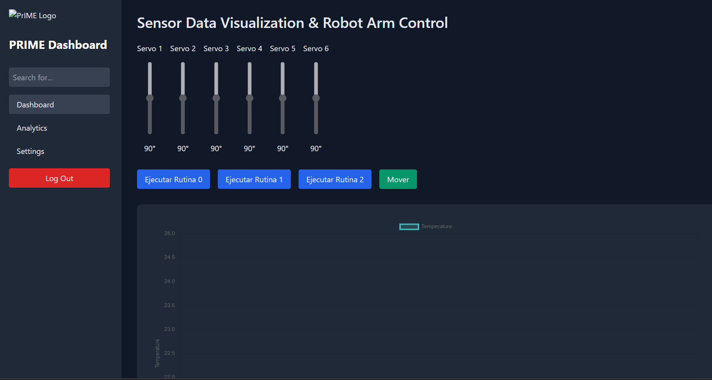

# 🌐 Flask API con MongoDB y CORS

Este proyecto implementa una API en Flask para interactuar con una base de datos MongoDB. La aplicación incluye manejo de CORS, carga de variables de entorno con `dotenv` y permite una configuración y despliegue sencillos.

## 📝 Características

- 🚀 **Flask** como framework para la API.
- 💾 **MongoDB** como base de datos.
- 🔒 **Variables de entorno** gestionadas con `dotenv`.
- 🌍 **CORS** habilitado para permitir solicitudes de otros orígenes.
- 📊 Endpoints para inserción, recuperación de datos y estadísticas.

## 📦 Requisitos

- **Python 3.x**
- **MongoDB**
- Archivo `.env` con las variables de conexión.

## 📂 Estructura del Proyecto

```plaintext
project/
├── app.py              # Código principal de la aplicación
├── requirements.txt    # Librerías requeridas
├── .env                # Variables de entorno (MONGO_URI, DATABASE, COLLECTION)
├── templates/
│   └── index.html      # Plantilla HTML para la página de inicio
└── static/
    └── style.css       # Archivo de estilos CSS
```

## ⚙️ Configuración
```plaintext
git clone <URL_DEL_REPOSITORIO>
cd project

pip install -r requirements.txt
```

## 🚀 Ejecución de la Aplicación
```plaintext
python app.py
```

## 🛠️ Endpoints Principales

- **`/getIp`**
    - **Método**: `GET`
    - **Descripción**: Obtiene la IP del cliente que realiza la solicitud.
    - **Respuesta**: JSON con la IP del cliente.

- **`/insert`**
    - **Método**: `POST`
    - **Descripción**: Inserta datos en MongoDB con una fecha de creación en formato ISODate.
    - **Requiere**: JSON con los datos a insertar.
    - **Respuesta**: JSON con un mensaje de éxito o error.

- **`/getData`**
    - **Método**: `GET`
    - **Descripción**: Obtiene datos de MongoDB, con un límite opcional de documentos.
    - **Parámetros URL**: `num` (opcional, número de documentos a devolver).
    - **Respuesta**: JSON con los documentos obtenidos.

- **`/stats`**
    - **Método**: `GET`
    - **Descripción**: Obtiene estadísticas de la colección en MongoDB, incluyendo el tamaño total y el conteo de documentos.
    - **Respuesta**: JSON con estadísticas de la colección.


## 📝 Código Esencial de la API Flask

El siguiente código implementa la API utilizando Flask, MongoDB, CORS, y dotenv para gestionar variables de entorno:

```python
from flask import Flask, request, jsonify, render_template
from pymongo import MongoClient
from datetime import datetime
from dotenv import load_dotenv
from flask_cors import CORS
import os

# Cargar variables de entorno
load_dotenv()

# Crear la aplicación Flask
app = Flask(__name__)
CORS(app)

# Conexión a MongoDB
client = MongoClient(os.getenv("MONGO_URI"))
db = client.get_database(os.getenv("DATABASE"))
collection = db.get_collection(os.getenv("COLLECTION"))  # Nombre de la colección

# Ruta para obtener la IP del cliente
@app.route('/getIp', methods=['GET'])
def get_ip():
    # Obtener la IP del cliente
    client_ip = request.headers.get('X-Forwarded-For', request.remote_addr).split(',')[0]
    print(f'IP: {client_ip}')
    return jsonify({'ip': client_ip})

# Ruta para insertar datos en MongoDB
@app.route('/insert', methods=['POST'])
def insert_data():
    data = request.json
    
    # Obtener la IP del cliente
    client_ip = request.headers.get('X-Forwarded-For', request.remote_addr).split(',')[0]
    print(f"Client IP: {client_ip}")

    if not data:
        return jsonify({"error": "No JSON data received"}), 400

    # Agregar la fecha actual
    data['created_at'] = datetime.now()

    # Insertar los datos en MongoDB
    collection.insert_one(data)

    return jsonify({"message": "Data inserted successfully"}), 201

# Ruta para obtener datos desde MongoDB con límite
@app.route('/getData', methods=['GET'])
def get_data():
    # Obtener la IP del cliente
    client_ip = request.headers.get('X-Forwarded-For', request.remote_addr).split(',')[0]
    print(f"Client IP: {client_ip}")

    # Obtener el parámetro 'num' de la URL
    num = int(request.args.get('num', 20))

    # Obtener los documentos limitados
    data = list(collection.find().sort("created_at", -1).limit(num))

    # Convertir ObjectId y fechas en strings
    for doc in data:
        doc['_id'] = str(doc['_id'])
        if 'created_at' in doc:
            doc['created_at'] = doc['created_at'].isoformat()

    return jsonify(data), 200

# Ruta para obtener estadísticas de la colección
@app.route('/stats', methods=['GET'])
def get_collection_stats():
    # Pipeline de agregación para obtener estadísticas
    pipeline = [
        {
            "$group": {
                "_id": None,
                "totalSize": {"$sum": "$size"},
                "docCount": {"$sum": 1}
            }
        },
        {
            "$project": {
                "_id": 0,
                "totalSizeMB": "$totalSize",
                "docCount": 1
            }
        }
    ]

    # Ejecutar el pipeline
    result = list(collection.aggregate(pipeline))

    if result:
        return jsonify(result[0]), 200
    else:
        return jsonify({"error": "No data found"}), 404

# Ruta de inicio
@app.route('/home')
def analisis():
    return render_template('index.html')

# Iniciar la aplicación
if __name__ == '__main__':
    app.run(host='0.0.0.0', port=5000)
```

